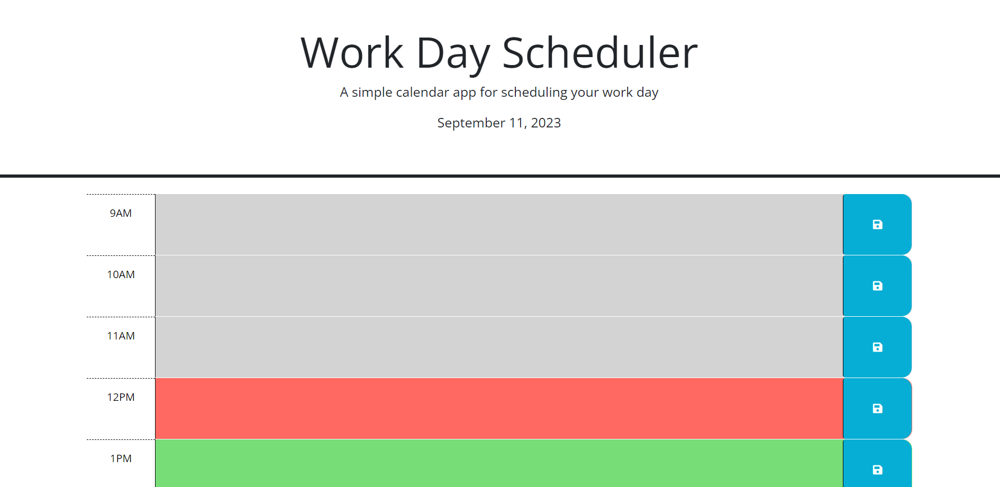

# CalenderApp

## Description

I built this proect to help other people stay organized whenever they have plenty of work to do. It also helps out because of the color cordination when it is grey it means it's the past
red means current and lastly the green is in the future. It is also updated with the current day, so it'll help out the perosn too. Including when the user hits the save button a
notification will appear that it has been saved in the localstorage.

## Installation

N/A

## Usage

Whenever the user types something in one of the boxes and clicks on the save button. It will stay there until the user wants to change it, so if the website closes or refreshes it will
always appear there and won't move.

https://josuehernand.github.io/CalendarApp/

## Credits

N/A

## License

Used the MIT License
